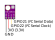
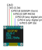

# Simple Clock & Thermometer (ESP32 + SSD1306 + BME280)

This is a simple example project for building a clock and thermometer with [Arduino core for ESP32](https://github.com/espressif/arduino-esp32#installation-instructions).

## Parts

You will need the following parts to complete the project:

* ESP32 development board (e.g. ESP-WROOM-32/Node-MCU-32S)
* BME280 themometer / humidity sensor
* SSD1306 based OLED display (128 x 64 pixel)

You will also need some wires and a breadboard or a soldering iron. 

## Libraries

In your Arduino IDE, go to *Tools* -> *Manage Libraries...*, and install the following:

* **BME280** by Tyler Glenn (tested with version 2.3.0)
* **Adafruit SSD1306** by Adafruit (tested with version 2.4.2)
  * Let it install the necessary dependencies as well.

Time synchronization via NTP is done without an external library.  
A big thank you to Sara Santos for the [sample code](https://randomnerdtutorials.com/esp32-date-time-ntp-client-server-arduino/)!

## Configuration

## Wifi
Enter name and password of your local 2.4G Wifi network in `secrets.h`.

*The file is marked to be ignored by git so that changes won't be checked in.*  
*Still, keep the file secret, e.g. when you copy the project without using git.*

## Time Zone

To choose the correct time zone you have to edit the folloping variables.

* `UTC_OFFSET` – how many seconds are you off from *Universal Time*?
* `DAYLIGHT_SAVING_OFFSET` – how many seconds between *your* normal and summer/daylight saving time?

`3600` seconds are equal to 1 hour.

## Assembly

Use a breadboard to put the parts together.  
You can still build a nice case and solder it after you got it working in the first place!

### BME280 Thermometer

The temperature/humidity/pressure sensor BME280 is connected via *I²C* interface using two wires for data and two for power.

* GND -> GND
* VIN -> 3V3
* SCL -> D22 (I²C SCL)
* SDA -> D21 (I²C SDA)

### SSD1306 OLED Display

The display is connected via SPI.

**Sidenote:**  
Actually bought it online as an I2C module but that was not true.
I had to learn it the hard way and wasted a lot of time until I found [this tutorial for the ESP8266](https://www.instructables.com/Wemos-D1-Mini-096-SSD1306-OLED-Display-Using-SPI/) – many many thanks!  
The interface is decided by some tiny resistors on the back. Mine was configured to use *4 wire SPI* interface (which is actually better because we it will not share the bus with the sensor and the bandwidth in comparison is much better).

So here is how to wire up the display:

* GND --> GND
* VCC --> 3V3
* D0  --> D18 (SPI Clock)
* D1  --> D23 (SPI MOSI)
* RES --> D19 (any free digital pin)
* DC  --> D4  (any free digital pin)
* CS  --> D5  (SPI SS)

You can basically pick any digital pin for *D0* and *D1*
– but don't forget to adapt the mapping in `SSD1306_128x64_SPI.h` if you pick different pins!

I bought a two colored *monochrome* display.
The first quarter is yellow, while the rest has blue pixels.
It is still technically *monochrome* because each pixel is either on or off
and the color cannot be changed programmatically.  
I think it has a good effect for setting appart the time from the sensor data.
